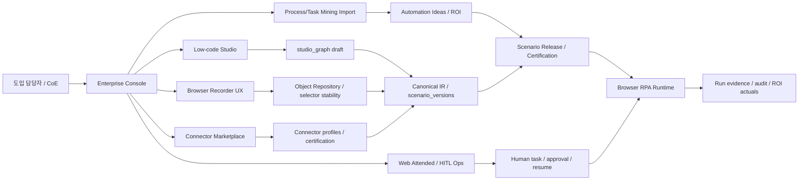
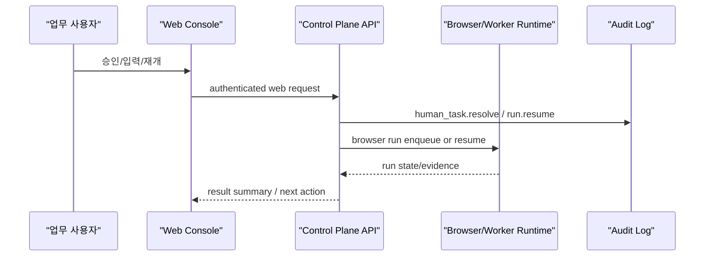

# 상용 RPA급 제품면 재설계

Date: 2026-06-30
Status: 설계 v0.4. 웹 전용 RPA 범위와 고객 보유 모니터링 데이터 활용 전제 최종 정렬본. 개발 착수 전 기준 문서.

Purpose:
- 기존 `docs/rpa-adoption-90plus-design-2026-06-29.md`와 `docs/browser-rpa-v2-design.md` 위에, UiPath/Automation Anywhere급 제품면 중 웹 전용 RPA에 맞는 Low-code Studio, Recorder UX, Process Mining, Connector Marketplace, Web Attended/HITL 운영 화면을 재설계한다.
- 본 문서는 구현 완료 증거가 아니다. 계약 파일(`api-surface.md`, `security-contracts.md`, `auth-rbac.md`, `ops-defaults.md`, `db/`, `schema/`, `ts/`)에 반영되기 전까지는 제품 설계 기준이다.
- 개발 순서는 "상용 RPA 전체 복제"가 아니라 "도입 담당자가 파일럿과 확산 결정을 내릴 수 있는 최소 제품면"을 우선한다.

Related:
- `docs/rpa-adoption-90plus-design-2026-06-29.md`
- `docs/rpa-adoption-full-design-2026-06-29.md`
- `docs/browser-rpa-v2-design.md`
- `docs/enterprise-alm-rbac-implementation-design.md`
- `api-surface.md` §1.4, §2.5, §7, §8
- `security-contracts.md` §14
- `auth-rbac.md` §6

Scope invariant:
- 본 제품은 웹 전용 RPA다.
- 데스크톱 앱, 사용자 PC 에이전트, endpoint client, Win32/UIA/Java/SAP GUI/Citrix 자동화는 제품 범위가 아니다.
- "Attended"는 웹 콘솔에서 사람이 승인, 입력, 검토, 재개하는 HITL 운영 경험만 뜻한다.
- 기업이 이미 운영 중인 PC 보안/행위 모니터링, DLP, EDR, task mining 결과는 외부 데이터 소스로 import할 수 있다. 단, 본 제품이 그 endpoint agent를 배포하거나 대체하지 않는다.

## 0. 결론

이 재설계 후의 설계 점수 목표는 92/100이다. 이전 상용 RPA 확장안은 기능축은 맞았지만, 기업 도입 담당자 관점에서는 "실제 구매/파일럿/전사확산 판단에 필요한 운영 증거"가 부족해 83/100 수준이었다. 이번 재설계는 다음 네 가지를 닫아 점수를 올린다.

| 보강 영역 | 기존 약점 | 재설계 결정 |
|---|---|---|
| 사용자 여정 | 기능 목록 중심 | 업무 담당자, CoE, 운영자, 도입 담당자별 end-to-end 여정으로 재정렬 |
| Recorder 신뢰성 | 녹화 이벤트와 draft IR 중심 | selector 안정성, 재녹화, self-heal 후보, 실패 설명, 승격 전 검증 gate를 제품 계약으로 분리 |
| Marketplace 실체 | 카탈로그는 있으나 enable/install/certification 부재 | 1st-party core connector 5개와 certification model을 먼저 열고, 3rd-party marketplace는 별도 gate |
| Attended/Process Mining 위험 | Attended를 별도 실행 클라이언트로 오해할 위험 | Attended는 웹 콘솔 기반 승인/입력/HITL 운영으로 제한하고, Process/Task Mining은 고객 보유 로그와 모니터링 결과 import-first로 시작 |

최종 제품 문장:

> 보안, 감사, RBAC, HITL, AI 정책 통제가 필요한 웹 자동화를 low-code authoring, recorder, connector catalog, CoE/ROI, web attended operations로 운영하는 enterprise RPA governance platform.

금지 문장:

- 전사 범용 RPA 완전 대체
- 웹 범위 밖 UI 자동화 완성
- 자체 endpoint agent 기반 task mining 엔진 완성
- 3rd-party connector marketplace 완성
- 로컬 앱/endpoint client 배포 제품

## 1. 기업 도입 담당자 관점의 평가 기준

도입 담당자는 기능 수보다 "도입했을 때 누가 만들고, 누가 승인하고, 누가 장애를 받으며, 실제 ROI가 증명되는가"를 본다.

| 이해관계자 | 구매 전 질문 | 설계 답변 |
|---|---|---|
| 현업 업무 오너 | 내가 직접 만들거나 설명할 수 있는가 | Low-code Studio와 Recorder를 "초안 생성 -> 검증 -> 파일럿 -> 운영승인" 여정으로 제공 |
| CoE/자동화팀 | 표준, 재사용, 변경관리, 품질을 통제할 수 있는가 | scenario release, certification, template, connector certification, ROI evidence를 gate로 사용 |
| 보안/감사 | Secret, PII, 감사, 테넌시가 안전한가 | SecretRef, RLS, RBAC, audit hash-chain, redaction, metadata-only evidence 원칙 유지 |
| IT 운영 | 배포, 장애, 알림, 지원 책임이 있는가 | controlled-prod readiness, SLO/on-call, alert receipt, worker health로 분리 |
| 구매/재무 | 기존 RPA보다 왜 필요한가 | 보안형 웹 자동화와 기존 RPA federation, 실제 ROI evidence, connector priority로 설명 |
| 고객 보유 모니터링 데이터 | 기존 보안/행위 모니터링 데이터를 자동화 후보 발굴에 쓸 수 있는가 | 고객이 승인·운영 중인 PC 보안/행위 모니터링, DLP, EDR, task mining export/API를 import source로 수용 |

90점 이상 조건:

| Gate | 통과 기준 |
|---|---|
| G1. 범위 정직성 | browser-first/web-only 원칙을 명확히 표시하고 로컬 앱/에이전트를 제외 |
| G2. Authoring 성공률 | 비개발자가 실행 가능한 draft를 만들고 실패 원인을 이해할 수 있음 |
| G3. 운영 통제 | prod 배포는 certification, support/RACI, training, ROI baseline을 요구 |
| G4. Connector 실체 | P0/P1 core connector가 실제 구현 상태와 SecretRef 경계를 가진다 |
| G5. Web Attended 운영 | 웹 콘솔 기반 승인, 입력, 재개, 예외 처리 화면이 설계됨 |
| G6. Process/Task Mining 통제 | source owner, schema mapping, lineage, retention 기준 없이는 import 결과를 ROI 근거로 사용 금지 |
| G7. ROI 증거 | 추정 ROI와 actual evidence를 분리하고 적자 자동화를 성공처럼 표시하지 않음 |

## 2. 현재 저장소 기준선

이미 있는 강점은 재사용하고, 새 제품면은 그 위에 얹는다.

| 영역 | 현재 기준선 | 재설계 위치 |
|---|---|---|
| Scenario/IR | 자연어 generation, draft/save/run, validation, release/certification 계약 | Studio graph와 validation UX를 IR 앞단 authoring model로 추가 |
| Browser Recorder | `browser_recording_sessions/events`, DOM 이벤트, draft IR 생성, 원문 입력값 저장 금지 | Recorder workbench를 검증/복구/승격 중심으로 보강 |
| Object Repository | `site_element_repository`, selector probe, stability | Studio/Recorder 공통 selector asset으로 승격 |
| Connector Catalog | read-only `/v1/connectors`, `/v1/templates`, SecretRef namespace-only | profile/enable/certification/install 계약을 단계적으로 추가 |
| CoE/ROI | automation ideas, ROI estimates, actual evidence, adoption evidence | Process/Task Mining import 결과가 automation idea로 들어오도록 확장 |
| ALM/RBAC | release package, maker-checker, certification, controlled-prod readiness | Studio publish flow의 운영 gate로 사용 |
| Federation | existing RPA handoff metadata/receipt boundary | 웹 범위 밖 자동화는 본 제품이 직접 수행하지 않고 기존 RPA handoff로 분리 |

### 2.1 구현 준비 상태

현재 저장소는 canonical IR, compile pipeline, scenario version/release, browser recording sessions/events, object repository, human tasks/run resume의 기반을 갖고 있다. 다만 Low-code Studio와 Recorder v2는 완성된 제품면이 아니라 Phase A 구현 대상이다.

- Studio: 현재는 easy/form/IR 편집과 생성 보조가 중심이다. Visual Canvas, graph version, validation run read model은 별도 계약과 UI가 필요하다.
- Recorder: DOM 이벤트에서 draft IR을 만들 수 있으나, review lifecycle, selector confidence, repair draft, promote-to-Studio는 별도 제품 workstream이다.
- Web Attended: 새 로컬 클라이언트를 만들지 않고 기존 `human_tasks`, `run.resume`, browser session capture 증거를 웹 콘솔 작업대에서 확장한다.
- Process/Task Mining: 제품 내부 task-mining agent가 아니라 고객 보유 source의 import-first 계약으로만 확장한다.

## 3. 목표 제품 아키텍처



아키텍처 원칙:

- Studio/Recorder는 IR을 직접 대체하지 않는다. 사용자 친화 authoring model을 만들고, 저장/실행 전 canonical IR과 기존 compile pipeline을 반드시 통과한다.
- Connector Marketplace는 평문 endpoint, token, Authorization header를 저장하지 않는다. 모든 credential과 endpoint material은 SecretRef 뒤에 둔다.
- Web Attended는 별도 실행 클라이언트가 아니다. 웹 콘솔에서 사람이 승인, 입력, 재개, 예외 판정을 수행하는 HITL 운영 표면이다.
- Process/Task Mining은 본 제품의 endpoint agent가 아니라 후보 발굴/ROI evidence source다. 고객이 이미 운영 중인 모니터링/마이닝 도구의 export/API를 받아 lineage와 ROI로 연결한다.

## 4. 재설계된 제품 여정

### 4.1 업무 담당자 여정

1. 업무 후보를 등록하거나 Process/Task Mining import 후보를 선택한다.
2. Recorder로 실제 웹 업무를 한 번 수행한다.
3. Studio에서 녹화 초안을 열어 단계명, 입력값, 예외 처리, 추출 규칙을 정리한다.
4. "실행 가능성 검사"에서 selector 안정성, site approval, credential, model policy, data extraction blockers를 확인한다.
5. 파일럿 실행 후 run evidence와 ROI actual을 연결한다.
6. CoE 검토가 끝나면 운영 버전으로 release 요청한다.

### 4.2 CoE/개발자 여정

1. Studio graph와 generated IR diff를 함께 본다.
2. Object Repository selector를 표준화하고 unstable selector를 교체한다.
3. Connector template을 붙이고 SecretRef profile을 연결한다.
4. test run, failure replay, HITL branch, rollback target을 검증한다.
5. certification checklist를 채운 뒤 staging/prod release를 제출한다.

### 4.3 운영자 여정

1. Bot pool, worker health, queue depth, alert, human task aging을 본다.
2. Web attended/HITL 대기열과 승인·입력 지연을 본다.
3. 장애 run은 failed state, root cause, selector drift, credential lock, site circuit, policy block으로 분류된다.
4. 외부 알림은 sent/accepted/delivered 증거 수준을 구분한다.
5. prod readiness가 blocked/deferred이면 운영 배포를 막는다.

### 4.4 도입 담당자 여정

1. 파일럿 업무 2-3개를 charter로 고정한다.
2. 개발 시간, 성공률, 예외율, 수작업 개입 시간, 운영 비용을 비교한다.
3. actual ROI evidence가 추정치를 뒷받침하는지 본다.
4. 보안/운영/교육/RACI sign-off를 확인한다.
5. 기존 RPA와 분리할 업무, handoff할 업무, 이 제품에 새로 태울 업무를 결정한다.

## 5. Low-code Studio 재설계

목표: 비개발자가 "폼을 채웠다"가 아니라 실제 실행 가능한 자동화 초안을 만들고, CoE가 운영 품질로 승격할 수 있게 한다.

### 5.1 제품 표면

| 화면 | 기능 | 기존 계약 연결 |
|---|---|---|
| Studio workspace | scenario, version, stage, owner, ROI, release 상태를 한 화면에서 표시 | scenario/release/automation idea |
| Flow canvas | navigate, act, extract, condition, loop, human task, api call을 시각적으로 편집 | canonical IR로 compile |
| Activity palette | 승인된 activity와 connector template만 노출 | connector/template catalog |
| Properties panel | selector, params, retry, timeout, recording policy, evidence policy 편집 | IR node policy |
| Object Repository panel | selector key, stability, usage, probe 결과 | `site_element_repository` |
| Test panel | step test, full dry run, run evidence, blocker list | validation/generation/run |
| Release panel | certification, maker-checker, staging/prod deploy | scenario releases |

### 5.2 신규 계약 후보

Studio graph는 IR의 사용자 편집 표현이다. IR과 1:1로 같다고 가정하지 않는다.

| 계약 | 설명 |
|---|---|
| `studio_projects` | tenant, scenario, owner, current graph, linked idea |
| `studio_graph_versions` | visual nodes/edges/properties, graph hash, compiled IR hash |
| `studio_validation_runs` | graph validation, IR compile, selector probe, connector readiness 결과 |
| `studio_assets` | reusable snippet/template binding metadata. Secret material 없음 |

필수 규칙:

- Studio graph 저장은 가능해도 실행은 canonical IR compile 통과 후에만 허용한다.
- validation은 `well_formed`, `runnable`, `operable`, `prod_ready`를 분리한다.
- "검증 통과"라는 단일 문구를 쓰지 않는다. 실행 불가 IR을 통과처럼 보이면 안 된다.
- graph와 IR의 diff, hash, compiler version을 release package에 포함한다.

검증 단계 정의:

| 단계 | 의미 | 성공으로 볼 수 없는 상태 |
|---|---|---|
| `well_formed` | Studio graph/IR schema, static validation, IREL compile, compiled AST 생성 여부 | schema/static compile 실패 |
| `runnable` | target/site, start URL, params, selector refs, identity/network/credential refs, required probes | probe `not_run`, selector 미검증, target/identity 미해결 |
| `operable` | worker/browser pool, queue, lease, audit/redaction, alert, HITL resume 운영 준비 | runtime health 미확인, audit/redaction 미확인 |
| `prod_ready` | certification, maker-checker, release gate, controlled-prod readiness, support/RACI evidence | `blocked`, `deferred`, `not_run`, evidence missing |

compile 통과는 `well_formed` 근거일 뿐 `runnable`, `operable`, `prod_ready` 성공으로 합성하지 않는다.

### 5.3 수용 기준

| 기준 | 목표 |
|---|---|
| 비개발자 생성 성공 | Recorder 또는 Studio에서 draft 생성 후 blockers를 이해할 수 있음 |
| 실행 가능성 | save 전 `extract.instruction`, navigate reachability, site target, selector probe를 확인 |
| 운영성 | prod release 전 rollback target, owner, support model, ROI baseline 요구 |
| 유지보수 | selector 변경이 Object Repository에서 사용처와 함께 보임 |

## 6. Recorder UX 재설계

목표: 녹화된 이벤트를 draft IR로 바꾸는 수준에서 끝내지 않고, "깨지기 쉬운 녹화"를 운영 가능한 자동화 후보로 다듬는다.

### 6.1 Recorder flow

```text
start recording
  -> capture DOM events
  -> classify event intent
  -> create object repository candidates
  -> generate draft IR
  -> validate selectors and required instructions
  -> explain blockers
  -> allow re-recording or repair
  -> promote to Studio draft
```

### 6.2 제품 기능

| 기능 | 설계 |
|---|---|
| Selector confidence | selector uniqueness, text/role fallback, sample URL match count, recent probe history로 `confidence=high|medium|low` 산정 |
| Re-record segment | 전체 재녹화가 아니라 특정 step range만 다시 녹화해 graph patch 생성 |
| Self-heal candidate | 실패 run에서 대체 selector 후보를 제안하되 자동 prod 반영 금지. CoE 승인 필요 |
| Failure explanation | `site_profile_unresolved`, `selector_not_found`, `multiple_matches`, `extract_instruction_missing`, `credential_required`, `policy_blocked` 등 사용자 언어로 표시 |
| Sensitive input guard | raw value/password/token/cookie/otp/mfa 저장 금지 유지. value preview도 길이/마스킹 제한 |
| Recorder evidence | 녹화자, site, start_url, event count, draft_ir hash, validation result, redaction status 기록 |

### 6.3 기존 계약 보강

| 현재 | 보강 |
|---|---|
| `browser_recording_sessions.status` | `completed` 이후에도 `review_needed`, `promoted_to_studio`, `discarded` 같은 authoring lifecycle 별도 원장 필요 |
| `browser_recording_events` | event intent, selector candidates, confidence metadata 추가 후보 |
| `site_element_repository.stability` | `last_probe_result`, `confidence`, `replacement_candidate_of` 추가 후보 |
| complete response | `draft_ir`뿐 아니라 blocker categories, repair suggestions, object repo changesets 포함 |

### 6.4 수용 기준

- 녹화 완료 화면은 "실행 가능", "수정 필요", "정책 차단", "site/session 필요"를 분리 표시한다.
- selector probe 포트가 없으면 `not_run`으로 표시하고 성공으로 합성하지 않는다.
- self-heal 후보는 draft/studio patch로만 열고 prod 버전을 조용히 변경하지 않는다.
- 녹화 기반 draft가 실패하면 사용자는 어느 단계가 왜 실패했는지 볼 수 있어야 한다.

## 7. Connector Marketplace 재설계

목표: read-only catalog를 넘어서, 기업이 실제 도입 범위를 결정할 수 있는 1st-party connector catalog와 인증 모델을 만든다.

### 7.1 우선순위

P0/P1 core connector는 5개로 시작한다.

| 우선 | Connector | 이유 | 초기 범위 |
|---|---|---|---|
| 1 | Browser web app / portal | 현재 제품 강점과 일치 | site, session, object repo, recorder template |
| 2 | HTTP API | 시스템 연계 기본 | SecretRef bearer, HTTPS, allowlist, idempotency |
| 3 | Excel/CSV browser files | 현업 파일 업무 빈도 높음 | download/upload artifact, CSV/table extraction |
| 4 | Notification webhook | 운영 알림/에스컬레이션 필요 | SecretRef endpoint, sent/accepted/delivered evidence 분리 |
| 5 | Existing RPA handoff | 웹 범위 밖 자동화와 기존 RPA 공존 | provider profile, dispatch attempt, callback receipt |

P2 후보:

- Email/Outlook/Exchange
- Teams/Slack provider-specific notification
- Database/PostgreSQL read/write profile
- ServiceNow/Jira ticketing
- External IDP/OCR provider intake

### 7.2 Marketplace lifecycle

| 상태 | 의미 | 허용 행동 |
|---|---|---|
| `available` | 구현 및 계약 존재 | template 사용 가능. profile 생성은 connector profile 계약 구현 후 허용 |
| `requires_admin` | 보안/SecretRef/owner evidence 필요 | admin setup 후 사용 |
| `candidate` | 로드맵 또는 metadata-only | 조회와 검토만 가능 |
| `blocked` | 현재 제품 범위 밖 | 실행 surface 없음 |

추가로 connector enable/install이 열리면 다음 상태를 별도 원장으로 둔다.

```text
draft -> security_review -> certified -> enabled -> disabled -> deprecated
```

### 7.3 Connector certification

| 증거 | 필수 조건 |
|---|---|
| Manifest | id, version, kind, permissions, supported actions, allowed hosts, SecretRef namespaces |
| Security review | SecretRef-only, no raw endpoint/token, audit action, RBAC action |
| Runtime capability | executor 존재 또는 metadata-only 명시 |
| Test evidence | local unit/contract tests, negative secret tests |
| Owner evidence | endpoint ownership, credential rotation owner, support owner |
| Receipt semantics | sent/accepted/delivered/completed의 의미와 증거 |

필수 규칙:

- marketplace UI가 candidate를 enabled처럼 보이면 안 된다.
- raw endpoint URL, webhook URL, provider token, OAuth secret, Authorization header는 manifest/API/audit/UI에 저장하지 않는다.
- 3rd-party connector는 signing, SBOM, sandbox, review process가 생기기 전까지 P3로 둔다.

## 8. Web Attended/HITL 운영 화면 재설계

목표: 별도 로컬 앱 없이, 웹 콘솔 안에서 사람이 승인·입력·검토·재개하는 attended 운영 경험을 설계한다. 이 제품은 웹 전용 RPA이므로 로컬 보조봇, endpoint agent, client lifecycle은 범위가 아니다.

### 8.1 제품 경계

P1에서는 "Web Attended/HITL 운영 화면"만 연다. 로컬 자동화나 endpoint agent는 후속 단계에도 본 제품 범위로 열지 않는다. 웹 밖 자동화가 필요하면 기존 RPA handoff 또는 외부 시스템 연계로 분리한다.

포함:

- human task inbox
- approval and rejection workbench
- user-approved web run launch
- web form/prompt input
- suspended run resume
- browser session capture status

제외:

- Win32/UIA/Java/SAP GUI/Citrix selector engine
- 로컬 앱, endpoint agent, endpoint client
- 사용자 화면 캡처/키 입력/로컬 파일 자동화
- credential value local storage
- offline local queue
- MFA/CAPTCHA 자동 우회

### 8.2 Web Attended architecture



### 8.3 신규 계약 후보

| 계약 | 설명 |
|---|---|
| `web_attended_sessions` | web console에서 사용자가 시작한 attended work session metadata |
| `web_attended_run_requests` | user-approved web run launch, consent, linked run/human task |
| `human_task_workbench_views` | approval/input/validation/retry 화면용 read model |
| `run_resume_requests` | suspended run 재개 요청, 입력 refs, actor, audit correlation |
| `browser_session_capture_requests` | 웹 업무 세션 등록 상태. 쿠키/자격증명/OTP 원문 저장 금지 |

### 8.4 운영 화면

| 화면 | 핵심 정보 |
|---|---|
| Human task inbox | 승인, 입력, 검증, 예외 처리 대기열 |
| Run resume | 어떤 run이 사람 입력을 기다리는지, 누가 어떤 값으로 재개했는지 |
| Approval workbench | 승인/반려 사유, evidence refs, SoD 상태 |
| Session capture | 사이트 로그인 세션 등록 상태와 만료. Secret 값 미노출 |
| Policy | HITL timeout, escalation, break-glass owner, retention |

### 8.5 수용 기준

- web user identity, role, SoD, audit correlation이 모든 승인/입력/재개에 남아야 한다.
- user consent가 필요한 run은 무인 실행처럼 표시하지 않는다.
- 사람이 입력한 값은 schema validation과 redaction policy를 통과해야 한다.
- session capture는 쿠키/자격증명/OTP 원문을 API/UI/audit에 노출하지 않는다.
- 웹 콘솔이 닫혔거나 사용자가 응답하지 않으면 성공으로 합성하지 않고 timeout/escalation으로 전이한다.

## 9. Process/Task Mining Import 재설계

목표: 본 제품이 PC 에이전트를 배포하지 않으면서도, 기업이 이미 운영 중인 업무 로그, PC 보안/행위 모니터링, DLP/EDR, task mining 도구의 export/API를 받아 자동화 후보와 ROI evidence로 연결한다.

### 9.1 단계

| 단계 | 범위 | 성공 기준 |
|---|---|---|
| P1 CSV/import-first | 업무 로그 CSV/XLSX 업로드 또는 API import 결과를 automation idea로 변환 | 후보 생성, ROI baseline, source lineage |
| P2 dashboard | 빈도, 처리시간, 변동성, 예외율, 부서별 후보 ranking | aggregation, source lineage, evidence export |
| P3 customer task telemetry import | 고객 보유 PC 모니터링/task mining/DLP/EDR export 또는 API 수신 | source owner, schema mapping, event lineage, ROI 후보 연결 |
| P4 in-product endpoint agent | 본 웹 전용 제품 범위 아님 | 외부 도구 결과 import만 허용 |

### 9.2 데이터 계약 후보

| 계약 | 설명 |
|---|---|
| `process_mining_imports` | source, uploader, schema mapping, row count, anonymization mode |
| `process_mining_events` | case alias, activity, timestamp, duration, org unit. 원문 사용자 식별자 금지 |
| `process_mining_candidates` | automation idea 후보, score, evidence lineage |
| `process_mining_source_policies` | source owner, approved source type, schema mapping, retention, lineage policy |

### 9.3 고객 보유 모니터링 데이터 수용 원칙

| 항목 | 설계 통제 |
|---|---|
| 고객 PC 모니터링/task mining 데이터 | 고객이 운영 중인 승인된 export/API source로 수용한다. 본 제품은 endpoint agent를 배포하지 않는다 |
| 원본 로그 과다 저장 | import 시 자동화 후보 발굴에 필요한 최소 필드만 정규화한다. 원본 파일은 artifact retention/RBAC 적용 |
| source authority | source owner, source system, import time, schema version, evidence ref를 남긴다 |
| 식별자 처리 | 개인 단위 분석이 고객 정책상 허용되어도, 본 제품의 기본 dashboard는 부서/업무/시나리오 중심으로 시작한다. 개인 식별자는 source policy가 허용한 alias만 사용한다 |
| ROI 과장 | actual evidence 없으면 추정치로만 표시. 자동 승인 금지 |

### 9.4 수용 기준

- source가 `process_mining` 또는 `task_mining`인 automation idea는 source lineage와 import id를 가진다.
- aggregation threshold 미만의 부서/사용자 조합은 표시하지 않는다.
- import schema mapping 실패, timestamp 불일치, case id 누락은 fail-closed다.
- "내장 task mining engine"이라고 표시하지 않는다. 고객 보유 모니터링/마이닝 도구의 import/dashboard라고 표시한다.

## 10. 통합 데이터 흐름

```text
Process/Task Mining Import
  -> Automation Idea
  -> ROI Estimate
  -> Studio Project
  -> Recorder/Studio Draft
  -> Canonical IR
  -> Validation
  -> Pilot Run
  -> ROI Actual Evidence
  -> Certification
  -> Release
  -> Runtime / Web HITL
```

불변 조건:

- 각 단계는 source lineage를 잃지 않는다.
- Secret/endpoint/user raw activity는 evidence에 저장하지 않는다.
- draft, pilot, certified, prod는 상태와 권한이 다르다.
- blocked/deferred/unknown을 성공으로 합성하지 않는다.

## 11. API/DB 반영 순서

개발 전 계약 변경은 다음 순서로 연다.

| 순서 | 계약 변경 | 이유 |
|---:|---|---|
| 1 | Studio graph/validation read model | Low-code Studio를 IR 직접 편집이 아닌 제품 표면으로 만들기 위함 |
| 2 | Recorder review/repair metadata | 녹화 실패 원인과 selector 안정성을 제품화 |
| 3 | Connector profile/certification ledger | marketplace가 read-only 카탈로그를 넘기 위한 최소 원장 |
| 4 | Process/Task Mining import/candidate lineage | ROI 후보 source를 안전하게 연결 |
| 5 | Web attended/HITL run request contracts | 웹 콘솔 기반 승인/입력/재개 화면의 SSoT |

초기에는 모든 신규 계약을 metadata-first로 열고, runtime side effect는 별도 gate를 둔다.

## 12. 화면 IA 재설계

| 상위 메뉴 | 하위 화면 | 사용 목적 |
|---|---|---|
| Automations | Studio, Recorder, Versions, Releases | 만들기, 수정, 검증, 배포 |
| Discovery | Ideas, Process/Task Import, ROI, Pilot Evidence | 후보 발굴과 도입 판단 |
| Marketplace | Connectors, Templates, Profiles, Certification | 재사용/연계/보안 검토 |
| Operations | Runs, Queues, Bot Pools, Alerts, Web Attended | 운영 감시와 장애 대응 |
| Governance | RBAC, Audit, AI Policy, Readiness, Evidence Packs | 감사/보안/승격 gate |

UX 원칙:

- "검증 통과" 대신 `정적 구조`, `실행 가능성`, `운영 준비`, `prod 준비`를 나누어 표시한다.
- candidate/blocked connector는 버튼 상태와 문구에서 실행 불가를 명확히 표시한다.
- Web Attended 화면은 사용자의 승인/입력이 필요한 run을 무인 자동화 성공률에 섞지 않는다.
- Process/Task Import 화면은 고객 보유 모니터링 데이터의 source lineage와 자동화 후보 연결을 중심으로 보여준다.

## 13. 로드맵

### Phase A: Studio + Recorder MVP

목표: 비개발자가 실행 가능한 browser automation draft를 만들고 실패 원인을 이해한다.

구현 후보:
- Studio workspace와 graph version 계약
- Visual Canvas node palette/properties panel(`navigate`, `act`, `extract`, `condition`, `human_task`, `api_call`)
- Recorder review/repair workbench
- selector confidence/probe 결과 표시
- validation result 분리
- draft to Studio promotion

완료 기준:
- 녹화 완료 후 draft IR과 blocker가 명확히 표시된다.
- Studio에서 extract instruction, site target, selector, params를 수정할 수 있다.
- compile 실패와 runnable 실패가 분리된다.

### Phase B: Core Connector Marketplace

목표: 5개 core connector를 실제 도입 검토 가능한 수준으로 만든다.

구현 후보:
- connector profile ledger
- connector certification status
- HTTP API, Excel/CSV, webhook, browser portal, existing RPA handoff profile UX
- SecretRef-only setup wizard

완료 기준:
- available/requires_admin/candidate/blocked 상태가 사용자 행동을 정확히 제한한다.
- endpoint/token raw material은 UI/API/audit에 나타나지 않는다.
- connector별 receipt semantics가 명확하다.

### Phase C: Web Attended/HITL Ops MVP

목표: 별도 로컬 앱 없이 웹 콘솔에서 승인, 입력, 재개, 예외 처리를 운영할 수 있게 한다.

구현 후보:
- human task inbox 고도화
- web attended run request 원장
- suspended run resume workbench
- approval/rejection evidence UI
- browser session capture 상태 UI

완료 기준:
- 승인/입력/재개 actor와 audit correlation이 남는다.
- timeout/escalation이 성공처럼 보이지 않는다.
- browser run launch와 human input 중심으로 pilot 가능하다.

### Phase D: Process/Task Mining Import MVP

목표: 안전한 후보 발굴과 ROI evidence pipeline을 만든다.

구현 후보:
- process/task mining import metadata
- schema mapping validation
- candidate generation to automation ideas
- source policy and lineage check
- dashboard source lineage

완료 기준:
- imported/process_mining/task_mining source가 ROI report에 lineage로 표시된다.
- 고객 보유 모니터링 source, schema version, import evidence가 표시된다.
- source policy 또는 schema mapping 실패 시 후보 생성 또는 표시가 차단된다.

### Phase E: Enterprise Polish

목표: 전사 확산 전 필요한 지원/교육/패키지를 완성한다.

구현 후보:
- Buyer one-pager
- pilot charter template
- support/RACI evidence
- training completion evidence
- worker drain/rolling deploy gate와 run handoff 운영 절차
- migration/federation playbook
- implementation partner guide

## 14. 미결정 사항

개발 전 owner decision이 필요한 항목이다. 미정이면 성공으로 표시하지 않는다.

| ID | 결정 필요 | Owner | 미정 시 처리 |
|---|---|---|---|
| D-STUDIO-1 | Studio graph를 IR과 얼마나 독립적으로 versioning할지 | Product/Architecture | IR-only 편집으로 제한 |
| D-REC-1 | self-heal 후보를 자동 적용할 수 있는 환경이 있는지 | CoE/Security | draft patch만 허용 |
| D-CONN-1 | P0/P1 connector 5개의 실제 고객 우선순위 | Product/Sales/CoE | 위 기본 순서 사용 |
| D-CONN-2 | connector enable/install 권한과 승인자 | Security/Admin | read-only catalog 유지 |
| D-ATT-1 | Web attended에서 허용할 human task kind와 timeout/escalation 기본값 | Product/Ops | 기존 human task 정책만 사용 |
| D-ATT-2 | session capture evidence의 보존 기간과 마스킹 수준 | Security/Privacy | Secret/쿠키/OTP 원문 저장 금지 유지 |
| D-MINING-1 | process/task mining에 허용되는 고객 보유 로그·모니터링 source | IT/Security/Business | manual/imported idea만 허용 |
| D-MINING-2 | source별 식별자 alias, aggregation, retention 정책 | IT/Security/Data Owner | 부서/업무 단위 집계만 표시 |

## 15. 설계 점수 재평가

| 영역 | 이전 | 재설계 후 | 근거 |
|---|---:|---:|---|
| 제품 포지셔닝 | 8 | 9 | web-only + RPA governance + Web Attended/HITL 명확화 |
| Low-code Studio | 6 | 9 | graph, validation, release 여정 정의 |
| Recorder UX | 6 | 9 | selector confidence, repair, failure explanation 포함 |
| Connector Marketplace | 6 | 8 | core connector 5개와 certification model 정의 |
| Web Attended/HITL | 4 | 8 | 웹 콘솔 기반 승인/입력/재개 운영 표면 설계 |
| Process/Task Mining Import | 5 | 8 | 고객 보유 모니터링 데이터 import-first, source lineage, ROI 연결 설계 |
| 보안/거버넌스 | 11 | 12 | SecretRef/RBAC/audit 원칙 유지 |
| 운영/지원 | 8 | 10 | support/RACI/readiness/alert/human task aging과 연결 |
| ROI/TCO | 7 | 10 | automation idea, ROI actual, process import lineage 연결 |
| 구현 착수성 | 8 | 10 | Phase A-E와 계약 순서 명확 |
| 합계 | 83/100 | 92/100 | 설계 기준. 구현 점수 아님 |

해석:
- 설계는 90점 이상 목표에 도달했다.
- 구현 준비도는 별도다. 특히 Studio graph, connector certification, Web Attended/HITL, process/task import 계약이 아직 SSoT에 반영되어야 한다.
- 전사 RPA 대체 준비도는 아니다. 전사 확산은 certified marketplace, 고객 보유 모니터링 source 연계, 운영 evidence가 구현된 뒤 다시 평가한다.

## 16. 개발 착수 Backlog

### P0

1. Studio graph/version/validation 계약 추가
2. Recorder review/repair metadata 계약 추가
3. Studio UI에서 validation 결과 4단계로 분리
4. Recorder 완료 화면에 blockers, selector confidence, promote-to-studio 추가
5. Connector catalog 상태 UX 정리: available/requires_admin/candidate/blocked

### P1

1. Connector profile/certification ledger
2. Core connector setup wizard
3. Process/task mining import metadata와 automation idea linkage
4. Web attended run request와 run resume ledger
5. Buyer/pilot evidence pack export

### P2

1. Web attended/HITL workbench 고도화
2. Email/Teams/Slack provider-specific connector
3. Database connector profile
4. Process/task mining dashboard
5. External IDP/OCR provider setup wizard

### P3

1. 3rd-party marketplace signing/SBOM/sandbox
2. 외부 RPA handoff provider profile 확장
3. Process/task mining import connector hardening
4. Enterprise migration toolkit from existing RPA vendors
