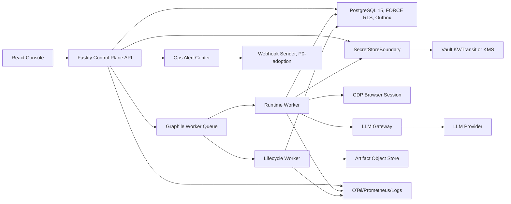

# RPA 도입 갭 해소 전체 설계

Date: 2026-06-29
Status: 설계 v0.4 완료 후보. 외부 검토 P1 반영. 개발 승인 전 기준 문서.

Adoption score target:
- 90점+ 도입 평가 기준은 `docs/rpa-adoption-90plus-design-2026-06-29.md`를 우선 적용한다.
- 본 문서는 P0 구현 분해 기준이고, 90점+ 문서는 기업 도입 담당자 관점의 운영/지원/ROI/공존 전략 기준이다.
- 현재 worktree의 구현 초안은 90점 설계 점수 산정에 포함하지 않는다.
- 첨부 설계 검토의 종합 73/100 판단을 현재 준비도 기준으로 수용한다. 본 v0.4는 P1 결함(MD-1, MD-2, MIG-1, DEP-01, K8S-1, HB-1)을 설계 조건으로 닫는다.

Implementation evidence update (2026-06-29):
- K8S-1 is now covered as static packaging evidence: `deploy/k8s/base`, `deploy/helm/rpa`, and `npm --prefix codegen run k8s:static-smoke`.
- The Kubernetes package covers API, worker, lifecycle-worker, migration Job, ServiceAccounts, PDB, readiness/liveness probes, S3 artifact values, and SecretRef-only credentials.
- This does not grant production approval. Production still requires platform namespace/ingress approval, registry digest promotion, managed backup/PITR restore drill evidence, SLO/on-call sign-off, and deployment approval.

Source:
- 첨부 리포트: `C:\Users\ibiz\.codex\attachments\e04f4d8f-abee-40a9-8359-c5ce442bb724\pasted-text.txt`
- 저장소 계약: `README.md`, `api-surface.md`, `security-contracts.md`, `auth-rbac.md`, `ops-defaults.md`, `db/README.md`
- 멀티에이전트 읽기 전용 분석: 운영/배포, 런타임 신뢰성, 보안/거버넌스, AI/통합/제품범위

## 0. 완료 수준과 사용 방법

이 문서는 첨부 리포트의 갭을 개발 가능한 P0/P1/P2 설계로 닫는다. v0.1에서 남아 있던 모순은 다음 방식으로 정리했다.

| 항목 | v0.4 결정 |
|---|---|
| 외부 알림 | Product Open v1은 console-only를 유지한다. 도입 평가 갭 해소용 P0-adoption은 `webhook` first sender를 별도 구현 후보로 둔다 |
| 배포 source of truth | P0 파일럿 source of truth는 Docker/Compose다. k8s/Helm은 정적 검증된 패키징 증거로 제공하며, 운영 승인 후 source of truth로 승격한다 |
| migration 도구 | P0 기본은 repo-local Node runner다. Flyway/Sqitch는 후속 대체 가능하지만 P0 개발을 막지 않는다 |
| 기존 DB baseline | fresh install과 existing DB baseline을 모두 지원하되, table/RLS flag만으로 baseline을 각인하지 않는다. columns, constraints, FK, trigger, RLS policy body를 검증해야 한다 |
| credential lease | SecretStore resolve 전 acquire, terminal/abort/suspend에서 release, resume에서 재획득을 기본 생명주기로 닫는다 |
| maintenance discovery | 무가드 cross-tenant query 금지. tenant별 non-bypass 실행 또는 전용 BYPASSRLS role + `bypassrls.use` audit 중 하나로 닫는다 |
| lifecycle daily sweeper | artifact integrity/orphan sweeper는 빈 `MAINTENANCE_TENANT_IDS` 때문에 조용히 휴면하면 안 된다 |
| worker heartbeat | heartbeat는 worker dependency 준비 후 시작하거나 startup 실패 시 반드시 stop한다. fake-live 금지 |
| observability | `OTEL_EXPORTER=none|console|prometheus|otlp` 구현 증거가 있다. controlled-prod는 collector/Prometheus scrape, dashboard, alert owner 증거가 추가로 필요하다 |
| PR 순서 | 계약 PR과 구현 PR을 분리한다. 구현은 계약 변경 없이 진행하지 않는다 |

현재 worktree에는 Docker/Compose, maintenance tenant discovery, worker heartbeat 관련 미승인 구현 초안이 존재할 수 있다. 본 문서는 그 초안을 완료된 개발로 인정하지 않는다. 개발 승인 시 초안은 diff review 대상일 뿐이며, 계약과 테스트를 통과해야만 구현으로 채택한다.

## 1. 설계 원칙

- 계약이 우선이다. `state-machine.md`, `api-surface.md`, `security-contracts.md`, `auth-rbac.md`, `ops-defaults.md`, `db/*.sql`이 구현보다 앞선다.
- 조용한 false/unknown 금지. 모르는 상태를 성공, 0, delivered, healthy로 합성하지 않는다.
- Secret 값은 `SecretRef`/`SecretStore` 뒤에만 둔다. API, audit, log, artifact, LLM payload에 평문 secret이 들어가면 안 된다.
- 기존 한국어 도메인 용어와 계약명을 보존한다.
- P0는 범용 전사 RPA 대체가 아니다. 목표는 "고보안 AI-native 웹 RPA 파일럿 가능 상태"다.

## 2. 리포트 해석과 제품 경계

첨부 리포트의 핵심 판단은 "설계는 강하지만 도입 운영성이 부족하다"이다.

| 구분 | 리포트 판단 | 설계 반영 |
|---|---|---|
| 종합 위치 | 우리 솔루션 57.6/100, C+ 수준. 보안/거버넌스 설계는 B+급 | P0를 웹 한정 파일럿으로 재정의하고, 운영 갭을 우선 제거 |
| 강점 | Secret 경계, RLS 멀티테넌시, RBAC, HITL, 계약 우선 검증, 감사 | 절대 약화하지 않는 불변 조건 |
| 치명 약점 | 패키징, migration/rollback, 외부 알림, sweeper 휴면, worker heartbeat, 통합 폭, 생태계 | P0/P1/P2 로드맵과 PR 단위로 분리 |
| 과장 위험 | VLM, CAPTCHA 자동해결, 자연어 자동화, OCR/IDP, KMS, egress, shell 등 spec-only 또는 미지원 | 미지원 기능은 loud reject 또는 blocked로 표시 |
| 제품 정체성 | AI-native browser agent에 enterprise governance를 얹은 제품 | "브라우저 RPA + 거버넌스"로 포지셔닝 |

P0 제품 문장:

> 보안, 멀티테넌시, RBAC, 감사, HITL을 갖춘 AI-native 웹 업무 자동화 엔진.

P0에서 쓰지 말아야 할 문장:

- 전사 범용 RPA 플랫폼
- Desktop/SAP GUI/Citrix/Office 자동화 제품
- OCR/IDP/VLM 자동화 완성 제품
- CAPTCHA/MFA 자동 해결 제품
- 자연어로 모든 업무를 즉시 생성하는 제품
- 외부 Slack/Teams/email delivered 보장 제품

## 3. P0 범위

### 3.1 포함

| 포함 | 설명 |
|---|---|
| 웹 기반 업무 자동화 | Stagehand/CDP 기반 DOM 자동화, `navigate`, `act`, `observe`, `extract`, `api_call` 범위 |
| 보안 경계 | SecretRef, Gateway redaction, prompt injection 차단, artifact redaction/RBAC |
| 운영 제어 | run 생성/취소/재실행/우선순위, trigger, DLQ, HITL, Bot Pool/Worker Pool |
| 배포 가능성 | Docker/Compose 재현 배포, migration job, runtime 역할 분리 |
| 기본 복구성 | sweeper tenant discovery, worker heartbeat, credential lease enforcement |
| 관찰성 | OTel 이름 계약 유지, 운영 backend 전송을 위한 `otlp|prometheus` 확장 |
| 감사 검증 | append-only/hash-chain audit verifier의 운영 표면화 |

### 3.2 제외

| 제외 | 이유 | 후속 |
|---|---|---|
| Desktop/SAP GUI/Citrix/Office | 별도 endpoint runner와 selector model 필요 | P2 전략 결정 |
| OCR/이미지/PDF IDP | 현재 성공 경로는 text/CSV/JSON deterministic extractor | P1.5 또는 P2 |
| VLM self-heal | masked `vlm_input` artifact, evidence schema, HITL fallback 필요 | P2 |
| CAPTCHA/MFA 자동 해결 | 법무/보안/사이트 정책 결정 필요 | P1은 human-first suspend까지만 |
| 3rd-party marketplace | manifest, signing, sandbox, certification 필요 | P2/P3 |
| 외부 delivered 보장 | provider receipt와 callback 없이는 보장 불가 | P0-adoption은 `sent` 증거까지만 |

## 4. 닫힌 의사결정

아래 결정은 P0 개발을 시작하기 위한 기본값이다. 조직 정책이 다르면 후속 override로 바꿀 수 있으나, 현재 설계 기준으로 개발을 막지 않는다.

| ID | 결정 | P0 기본값 | 후속 변경 가능성 |
|---|---|---|---|
| D-DEPLOY-1 | 배포 source of truth | Docker/Compose를 P0 파일럿 기준으로 둔다. k8s/Helm은 `deploy/k8s/base`, `deploy/helm/rpa`, `npm --prefix codegen run k8s:static-smoke`로 검증되는 패키징 증거다 | 운영팀 승인 후 k8s/Helm 또는 GitOps로 승격 |
| D-MIG-1 | migration 도구 | repo-local Node runner + `schema_migrations` ledger | Flyway/Sqitch 전환 가능 |
| D-DR-1 | 복구 기준 | P0 파일럿은 backup restore runbook + smoke 증거. RPO/RTO는 release packet 입력값 | 운영 SLA 확정 시 PITR/restore drill 강화 |
| D-NOTIFY-1 | 외부 알림 채널 | Product Open v1은 console-only. P0-adoption first sender는 `webhook` | Slack/Teams/email 추가 |
| D-NOTIFY-2 | receipt 기준 | webhook HTTP 2xx는 `sent`만 인정. `delivered`는 provider callback/message id가 있을 때만 | provider별 receipt map 추가 |
| D-SECRET-1 | SecretStore/KMS | Vault KV v2 + Vault Transit 계열을 표준 backend로 둔다. 로컬은 SecretRef placeholder만 | cloud KMS/HSM 가능 |
| D-EGRESS-1 | browser egress enforcement | CDP Fetch/Network 기반 차단을 P0 구현 기준으로 둔다 | proxy 병행은 운영 hardening |
| D-AUDIT-1 | audit verifier 운영 | tenant별 hourly verifier, critical mismatch, 결과 90일 보존 | WORM mirror와 보존기간 확장 가능 |
| D-RBAC-1 | 권한 스코프 | P0는 tenant-wide 현행 권한 유지 | folder/scenario/environment scope는 P1 |
| D-DESKTOP-1 | 범용 RPA 진입 | P0는 web-only 유지 | endpoint runner 투자는 P2 |

## 5. 목표 아키텍처

아키텍처 불변 조건:

- API와 worker는 동일 계약을 따르되 배포 단위는 분리 가능해야 한다.
- 상태 변경과 outbox/job enqueue는 동일 DB 트랜잭션 원칙을 유지한다.
- worker/lifecycle-worker는 runtime identity와 SecretRef purpose가 분리되어야 한다.
- 외부 전송과 object I/O는 real receipt가 있을 때만 성공으로 인정한다.
- telemetry label에는 Secret, URL query, artifact body, high-cardinality payload를 넣지 않는다.

## 6. P0 상세 설계

### P0-1. 배포 패키징

목표: 개발자 PC에서만 돌 수 있는 소스가 아니라, 파일럿 담당자가 재현 가능한 배포 단위를 제공한다.

| 항목 | 설계 |
|---|---|
| Docker image | 단일 runtime image를 만들고 `RUN_MODE=api|worker|lifecycle-worker|all`로 역할을 분리한다 |
| Compose | PostgreSQL 15, migration job, API, worker, lifecycle-worker, artifact local storage를 P0 source of truth로 기동한다 |
| k8s/Helm | 패키징 증거 제공. Kustomize base와 Helm chart가 API Deployment, worker Deployment, lifecycle-worker Deployment, migration Job, ServiceAccounts, Service, PDB, probes, S3 artifact values, SecretRef-only credentials를 제공한다. 단, production approval은 별도다 |
| Health | `/livez`, `/readyz`를 probe로 사용한다. DB, migration version, artifact topology mismatch는 ready 실패로 둔다 |
| Secret | image와 compose 파일에 secret 평문을 넣지 않는다. env example은 placeholder만 허용한다 |
| DB roles | API/worker는 non-`SUPERUSER`/non-`BYPASSRLS` app-role을 사용한다. migration/lifecycle BYPASSRLS는 전용 role과 audit를 요구한다 |

수용 기준:

- API, worker, lifecycle-worker가 분리 기동된다.
- API `/readyz`가 DB와 필수 설정을 확인한다.
- migration job이 `schema_migrations`와 DB smoke를 통과해야 API/worker ready가 가능하다.
- local compose smoke도 non-BYPASSRLS app-role 검증을 포함한다. superuser smoke는 catalog-only evidence로 표시한다.
- lifecycle-worker가 artifact store topology를 fail-closed로 확인한다.
- secret scan에서 평문 secret이 없어야 한다.

### P0-2. Versioned migration과 rollback/복구

현재 `db/README.md`는 SQL 적용 순서와 smoke를 정의하지만, 운영용 migration ledger와 existing DB baseline 절차가 부족하다.

| 항목 | 설계 |
|---|---|
| `schema_migrations` | `version`, `name`, `checksum`, `applied_at`, `applied_by`, `duration_ms`, `status`, `baseline` 기록 |
| runner | repo-local Node runner. 정해진 순서 외 적용, checksum drift, 부분 적용, 재적용을 fail-closed |
| fresh install | 빈 DB에는 `migration_concurrency_idempotency.sql` -> `migration_core_entities.sql` 순서로 적용하고 ledger를 남긴다 |
| existing DB baseline | 이미 두 SQL이 적용된 DB는 DDL을 재실행하지 않는다. 단 table/column/constraint/FK/trigger/RLS policy body 검증 후에만 `baseline=true` row를 넣는다 |
| migration style | P0는 forward-only를 기본으로 둔다. down migration을 성공처럼 제공하지 않는다 |
| rollback | DB rollback은 backup/PITR restore 또는 forward fix migration. scenario release rollback과 구분한다 |

Baseline 절차:

1. runner가 필수 테이블, column, CHECK/UNIQUE, tenant composite FK, audit append-only trigger 존재 여부를 확인한다.
2. 현재 repo의 두 migration checksum을 계산한다.
3. tenant-scoped table은 `ENABLE RLS`, `FORCE RLS`, strict `current_setting('app.tenant_id')::uuid` 정책을 확인한다. `USING (true)` 같은 permissive policy는 거부한다.
4. 기존 DB가 예상 shape와 일치하면 `schema_migrations`에 `baseline=true`, `status='applied'`로 기록한다.
5. shape가 다르면 drift로 중단하고, 자동 보정하지 않는다.
6. baseline 이후 새 migration은 일반 `baseline=false`로 적용한다.

수용 기준:

- 같은 migration을 두 번 적용하면 ledger 기준 no-op 또는 drift error가 난다.
- checksum이 다르면 적용을 거부한다.
- out-of-order 적용을 거부한다.
- 실패 migration은 부분 성공으로 기록되지 않는다.
- migration 후 `db/migration_smoke.sql`과 non-BYPASSRLS RLS smoke가 통과한다.
- table 존재와 `relrowsecurity`/`relforcerowsecurity` flag만 확인한 baseline은 수용하지 않는다.

### P0-3. Maintenance tenant discovery

리포트 지적: `MAINTENANCE_TENANT_IDS` 수동 등록 없이는 기본 배포에서 sweeper가 휴면할 수 있다.

목표: env 목록이 비었을 때 due work에서 tenant를 자동 발견한다.

자동 발견 대상:

- `browser_leases.state IN ('reserved','active') AND expires_at < now`
- `credential_leases.status='active' AND locked_until < now`
- `human_tasks` open/assigned/in_progress/escalated 중 `expires_at <= now`
- `workitems.status='processing'` 중 checkout timeout, 단 suspend pause 중 제외
- `artifacts.redaction_status='pending'` 또는 lifecycle claim 만료 후보

규칙:

- `MAINTENANCE_TENANT_IDS`가 있으면 그 목록이 authoritative다.
- discovery query는 payload 없이 `tenant_id`만 반환한다.
- fanout 중복은 허용하되 각 sweeper는 CAS/claim으로 idempotent해야 한다.
- discovery는 두 모델 중 하나만 허용한다: tenant별 non-bypass transaction에서 `SET LOCAL app.tenant_id`를 바인딩하거나, 전용 BYPASSRLS infra role로 실행하고 `bypassrls.use` audit를 남긴다.
- app-role에서 tenant GUC 없이 cross-tenant UNION을 실행하는 설계는 금지한다.
- artifact integrity/orphan daily sweeper는 `MAINTENANCE_TENANT_IDS` 공백 때문에 휴면하지 않는다. orphan sweeper는 전역 object-store 작업으로 cadence마다 1회 enqueue한다.

수용 기준:

- due work가 있는 tenant만 enqueue된다.
- due work가 없으면 enqueue하지 않는다.
- 명시 tenant list가 있으면 discovery query를 건너뛴다.
- 두 번 실행해도 상태가 중복 변경되지 않는다.
- non-BYPASSRLS role과 BYPASSRLS audited role 두 경로 중 채택 경로의 smoke evidence가 있다.
- integrity/orphan sweeper가 기본 배포에서 스케줄되는지 검증한다.

### P0-4. Worker self-registration와 heartbeat

리포트 지적: Bot Pool 용량이 수동 worker seed에 의존하면 운영 신뢰성이 낮다.

목표: runtime worker와 lifecycle-worker가 자기 등록하고 heartbeat를 갱신한다.

| 항목 | 설계 |
|---|---|
| self-register | startup 시 `workers(id, kind, status, heartbeat_at)` upsert |
| kind | browser worker는 `browser`, artifact lifecycle worker는 `sweeper` |
| interval | 기본 30초, stale 판정은 `ops-defaults.md` `worker.stale_threshold` 기본 2분과 정렬 |
| status | `draining`은 보존한다. `dead`만 명시적으로 `active` 복귀 가능 |
| shutdown | graceful shutdown 시 heartbeat timer 중지. 별도 `draining` 전이는 후속 |
| startup order | Vault/SecretStore, encryption key, browser/artifact store, queue runner 준비 전 heartbeat를 live로 노출하지 않는다 |

수용 기준:

- 수동 seed 없이 worker row가 생성된다.
- heartbeat 갱신 후 Bot Pool에서 live capacity로 계산된다.
- 2분 초과 stale worker는 capacity에서 제외된다.
- heartbeat 실패는 로그/alert로 표면화하고 fake healthy로 만들지 않는다.
- startup 중 dependency 초기화가 실패하면 heartbeat timer가 남지 않는다.

### P0-5. Credential lease dispatch enforcement

Implementation evidence update (2026-06-29): `runtime-worker-run-drive` and `runtime-worker-run-resume` acquire scenario credential slots before drive execution, return `SESSION_LOCKED` on contention, avoid executor bind on credential contention, clean up newly reserved browser leases, and release credential leases on terminal/resume/abort paths. Focused temp-PostgreSQL integration coverage is in `runtime-worker-drive.int.ts`, `runtime-worker-resume-drive.int.ts`, and `runtime-worker-abort-finalization.int.ts`.

리포트 지적: DDL/API/sweeper는 있으나 dispatch에서 lease를 획득하지 않으면 `max_concurrency`가 실제 효력이 없다.

목표: SecretRef resolve 또는 CDP fill 전에 credential slot을 원자적으로 획득한다.

흐름:

1. run target 해소 시 `credential_ref`, `site_profile_id`, `tenant_id`를 결정한다.
2. SecretStore resolve 전에 `credential_leases` slot을 CAS로 획득한다.
3. 획득 실패 시 `SESSION_LOCKED`로 deferred/retry 처리한다.
4. 획득 성공 후에만 SecretStoreBoundary가 `purpose='executor'` 또는 connector purpose를 resolve한다.
5. terminal, abort, suspend, worker outer catch에서 release-by-run을 수행한다.
6. 누수는 `credential_lease.locked_until_ttl`과 sweeper가 회수한다.

생명주기 표:

| 상황 | lease 처리 | SecretStore 처리 |
|---|---|---|
| run 시작, credential 필요 | SecretStore resolve 전 acquire | acquire 성공 후에만 resolve |
| acquire 실패 | `SESSION_LOCKED`, retry/defer | resolve 금지 |
| normal terminal | release-by-run | 추가 resolve 없음 |
| abort/cancel | release-by-run | 추가 resolve 없음 |
| human_task/challenge/operator pause suspend | 기본 release-by-run. 세션 유지 정책은 별도 결정 전까지 금지 | resume 시 재획득 후 resolve |
| resume | 기존 lease를 신뢰하지 않고 재획득 | acquire 성공 후 restore/resolve |
| worker crash | TTL 만료 후 sweeper가 expired 처리 | 새 worker가 재획득 전 resolve 금지 |

수용 기준:

- `max_concurrency=1`에서 동시 두 run 중 하나만 SecretStore resolve까지 진행한다.
- 실패 run은 secret 값을 resolve하지 않는다.
- terminal/abort/suspend 후 slot이 재사용 가능하다.
- resume은 stale lease를 재사용하지 않는다.
- lease 만료 sweeper가 idempotent하게 expired 처리한다.

### P0-6. 운영 알림

현재 계약은 Product Open v1의 알림 성공 경로를 console-only로 둔다. 이 계약은 유지한다. 다만 첨부 리포트의 도입 평가 관점에서는 외부 알림 부재가 감점이므로, "제품 오픈 P0"와 "도입 평가 갭 해소 P0-adoption"을 분리한다.

| 범위 | 결정 |
|---|---|
| Product Open v1 | console-only. `external_delivery:false`를 명확히 노출하고 Slack/Teams/email/webhook으로 위장하지 않는다 |
| P0-adoption | webhook first sender를 추가한다. webhook HTTP 2xx는 `sent`까지만 인정한다 |
| `delivered` | provider callback 또는 message id 기반 receipt가 있을 때만 사용한다 |
| ack | `POST /ack`는 operator acknowledgement일 뿐 외부 전송 성공 증거가 아니다 |

필요 데이터 모델 후보:

| 테이블 | 역할 |
|---|---|
| `notification_routes` | alert source/severity/tenant/group별 route policy |
| `notification_channels` | channel alias, provider alias, endpoint SecretRef, allowed domain metadata |
| `notification_deliveries` | alert generation별 delivery attempt, status, receipt metadata, retry state |
| `notification_delivery_dlq` | retry 소진 또는 permanent failure 원장 |

Webhook sender 기본 정책:

- endpoint URL과 signing secret은 SecretRef로만 참조한다.
- allowed domain/provider account를 통과해야 enqueue한다.
- HTTP 2xx + durable request id를 `sent` receipt로 기록한다.
- non-2xx, timeout, SecretRef 미해결, allowlist mismatch는 retry 또는 DLQ로 기록한다.
- `test_fake` sender는 staging 증거가 아니며 운영 receipt로 인정하지 않는다.

수용 기준:

- Product Open v1 화면/API는 console-only를 명확히 표시한다.
- webhook 미설정 상태에서 외부 전송을 성공으로 표시하지 않는다.
- webhook sender가 활성화되면 `sent|failed|deferred|dlq`가 receipt 근거와 함께 기록된다.
- ack와 external delivery 원장이 섞이지 않는다.

### P0-7. 관찰성 운영화

현재 코드는 `OTEL_EXPORTER=none|console|prometheus|otlp`를 허용한다. `prometheus`는 health probe 서버의 `/metrics`로 메트릭을 노출하고, `otlp`는 명시 collector endpoint로 trace/metric을 전송한다. 이는 exporter 표면의 repo-local 구현 증거이며, controlled-prod collector/dashboard/alert 승인 증거를 대체하지 않는다.

| 항목 | 설계 |
|---|---|
| exporter | `OTEL_EXPORTER=none|console|otlp|prometheus`로 확장 |
| OTLP | collector endpoint, TLS, resource attributes, batch export |
| Prometheus | `/metrics` 또는 ServiceMonitor. API와 worker 노출 경계 분리 |
| Queue depth | graphile queue unavailable이면 `available=false`, fake zero 금지 |
| 로그 | correlation_id, run_id, tenant_id 중심. URL query/secret 마스킹 |

수용 기준:

- OTel trace/metric이 collector 또는 Prometheus에서 관측된다.
- `queue_depth`, `llm_cost`, `llm_ttfb_ms`, `challenge_rate`, `site_block_rate` 등 필수 metric이 누락되지 않는다.
- Secret/high-cardinality payload가 label로 나가지 않는다.
- exporter unknown 값은 startup fail-closed.
- `none|console` 테스트를 유지하고, `prometheus` `/metrics`, `otlp` endpoint parsing, unknown-exporter fail-closed 테스트를 포함한다.

### P0-8. Audit verifier 운영화

현재 감사 로그 append/hash-chain 원칙과 verifier 함수는 존재한다. 부족한 부분은 "검증 결과를 운영자가 보는 표면"이다.

목표: 감사 해시체인 무결성을 주기적으로 검증하고, 결과를 운영 표면과 release evidence로 남긴다.

| 항목 | 설계 |
|---|---|
| schedule | tenant별 hourly verifier |
| result | `audit_verifier_runs`, `GET /v1/audit-log/verification-runs`, Audit Explorer로 노출 |
| severity | mismatch, missing previous hash, unsafe payload schema, retention violation은 critical |
| retention | verifier result 90일 보존 |
| BYPASSRLS | verifier가 BYPASSRLS를 쓰면 `bypassrls.use` audit를 남긴다 |

수용 기준:

- 정상 chain은 verified 상태로 노출된다.
- 중간 row 변조 fixture가 critical mismatch로 잡힌다.
- verifier 실패를 "unknown healthy"로 표시하지 않는다.
- release packet에 verifier 결과 요약을 넣을 수 있다.
- 구현 증거: `audit_verifier_runs` 원장, admin-only `POST /v1/audit-log/verification-runs/verify`, 조회용 `GET /v1/audit-log/verification-runs`, Audit Explorer 수동 실행/최근 결과 패널, `app/test/api-audit-verification.int.ts`, `web/test/audit-explorer.test.tsx`.
- 남은 운영화: hourly maintenance job과 external critical alert route는 P0-9/P1 알림 계약과 함께 닫는다. 현재 수동 API/콘솔 evidence는 도입 심사에서 hash-chain 검증 결과를 재현 가능한 형태로 제시할 수 있는 최소 운영 표면이다.

### P0-9. Security hardening closeouts

리포트의 보안 강점을 유지하면서 spec-only 갭을 닫는다.

| 갭 | 설계 |
|---|---|
| SecretRef namespace 불일치 | `rpa/<env>/<runtime>/<purpose>/<name>`를 staging/product 기준으로 강제하고, `secret://` 표기는 catalog display alias로만 정리 |
| Browser egress | navigation/api_call뿐 아니라 fetch/XHR/WebSocket/iframe/service worker/download를 CDP Network/Fetch 계층에서 차단 |
| KMS/envelope | Vault Transit 또는 cloud KMS를 선택하고 `enc_kid`, rotation, decrypt-old-session grace, receipt를 계약화 |
| BYPASSRLS | 허용 job, DB role, reason code, immutable audit payload를 registry로 닫음 |
| shell/file | P0 browser product mode에서는 계속 차단. signed registry 제품화는 별도 결정 |

수용 기준:

- unsupported shell/file/desktop action은 `unsupported_browser_product_action` 또는 capability mismatch로 loud reject.
- egress 우회 fixture가 network policy violation으로 차단된다.
- KMS key missing/unknown kid/tamper는 decrypt fail-closed.

Implementation evidence update (2026-06-29): browser lease bind now installs a required CDP `Fetch`/`Network` guard (`browser-network-guard.ts`) before executor/resolver access. Production worker composition injects `PgDurableSecurityAuditDecisionWriter`, and the guard appends durable `network.request` audit rows before `Fetch.continueRequest`/`Fetch.failRequest`; audit append failure blocks the request fail-closed. Focused unit coverage proves allowed-domain continuation, audit-before-continue, audit-failure fail-closed behavior, off-allowlist fetch/subresource failure, iframe/document navigation classification, WebSocket handshake detection, download cancellation, wildcard semantics, `blob:` nested-origin handling, and OOPIF/child-session tracking.

## 7. 계약 PR과 구현 PR 분해

개발 승인 후에는 아래 순서로 진행한다. 각 구현 PR은 선행 계약 PR 없이는 merge하지 않는다.

| 순서 | 계약 PR | 구현 PR | 필수 검증 |
|---|---|---|---|
| 0 | 미승인 구현 초안 표기와 문서 정리 | 없음 | git diff review, 완료 문구 제거 |
| 1 | `ops-defaults.md`, `db/README.md`: migration runner와 baseline | `scripts/db-migrate.mjs`, compose migration job | migration smoke, baseline fixture |
| 2 | `security-contracts.md`, `ops-defaults.md`: credential lease lifecycle | runtime dispatch acquire/release wiring | concurrency integration, SecretStore non-resolve test |
| 3 | `ops-defaults.md`, `api-surface.md`: maintenance discovery/readiness | maintenance scheduler discovery | unit + integration, no due-work fanout test |
| 4 | `ops-defaults.md`, `api-surface.md`: worker heartbeat/Bot Pool diagnostic | worker/lifecycle self-register heartbeat | heartbeat unit, Bot Pool stale capacity test |
| 5 | `ops-defaults.md`, deployment runbook | Dockerfile, compose, env example | compose config/smoke, secret scan |
| 6 | `ops-defaults.md`: `otlp|prometheus` exporter | OTLP/Prometheus bootstrap, `/metrics` | telemetry unit, exporter fail-closed |
| 7 | `api-surface.md`, `security-contracts.md`: audit verifier result surface | verifier API, evidence ledger, Audit Explorer surface | tamper fixture, API/RBAC/web tests, release evidence |
| 8 | `api-surface.md`, `security-contracts.md`: webhook notification contract | webhook sender, deliveries/DLQ | fake vs real receipt separation |
| 9 | deployment decision doc | k8s/Helm chart | helm template/lint, runtime probes |

## 8. P1/P2 로드맵

P1은 P0 파일럿을 안정화한 뒤 경쟁 격차를 줄이는 범위다.

| 영역 | 설계 후보 | 수용 기준 |
|---|---|---|
| 시각 저작 캔버스 | 기존 compile pipeline 재사용. 시민개발자 UX 개선 | 저장 전 AJV/IREL/static validation 통과, 미지원 flow 손실 금지 |
| LLM planner `llm_v1` | `ScenarioPlanner` 포트, generation artifact, LLM call ledger, blocker | 20개 골든 프롬프트 valid IR, target ambiguity는 blocked |
| Read-only tool calling | catalog search, target resolve, selector probe dry-run, schema lookup | mutating tool call 금지, audit/redaction/idempotency 유지 |
| Challenge handling | CAPTCHA/MFA 감지, human-first suspend, site circuit 측정 | 자동 solver 없이 HITL resume 성공 |
| IDP/OCR 1.5 | OCR connector, confidence schema, validation task | binary/PDF/image 지원 범위를 명시하고 unsupported는 422 |
| RBAC 세분화 | folder/scenario/environment scope와 SoD | tenant-wide 권한과 충돌 없이 fail-closed |
| API auth 확장 | OAuth2/basic/mTLS connector profile | raw Authorization 저장 금지, SecretRef + provider receipt |
| HA/DR | API replicas, worker concurrency, scheduler singleton, PITR | failover/restore drill evidence |

P2/P3는 범용 RPA 또는 벤더급 생태계 진입이다.

| 영역 | 조건 |
|---|---|
| Desktop/SAP GUI/Citrix/Office | 별도 endpoint runner, Windows session isolation, UIA/Win32/SAP selector model, local SecretStore bridge, evidence capture 필요 |
| VLM self-heal | masked image artifact, evidence schema, model capability, HITL fallback, privacy review 필요 |
| Connector SDK/Marketplace | signed manifest, permission review, sandbox/isolation, certification, revocation, compatibility matrix 필요 |
| 재사용 sub-workflow/library | versioning, dependency graph, release validation, ownership 필요 |
| 벤더급 운영 지원 | SLA, 교육, 인증, support process, marketplace governance 필요 |

## 9. 파일럿 수용 테스트

P0 완료는 아래 증거가 모두 있을 때만 주장한다.

- `npm --prefix codegen run typecheck`
- `npm --prefix codegen run fixtures`
- `npm --prefix app run typecheck`
- `npm --prefix app run test:unit`
- PostgreSQL 15 non-BYPASSRLS role DB migration smoke
- migration runner fresh install, baseline, checksum drift, out-of-order test
- Pilot backup/restore drill: `npm --prefix codegen run db:restore-drill:temp`
- Docker/Compose smoke
- Kubernetes/Helm packaging smoke: `npm --prefix codegen run k8s:static-smoke`
- Secret scan
- RLS isolation tests
- Credential lease concurrency integration
- Maintenance discovery unit/integration
- Worker heartbeat and Bot Pool capacity tests
- Notification fake vs real receipt separation tests
- OTEL/Prometheus exporter tests
- Audit verifier tamper test

## 10. 남은 owner input

아래는 개발을 막는 선택지가 아니라, 배포 환경에서 값을 채워야 하는 owner input이다.

| 입력 | 기본 설계 | owner가 채울 값 |
|---|---|---|
| container registry | local image tag | registry URL, promotion policy |
| Kubernetes/Helm release | static packaging evidence | namespace, ingress, registry digest, values override, ExternalSecret/SecretStore owner, deployment approval |
| artifact store | local fs for compose | S3/GCS/Azure backend, retention policy |
| webhook receiver | disabled | endpoint SecretRef, signing secret, allowed domain |
| Vault | Vault KV/Transit 표준 | mount path, AppRole, rotation cadence |
| backup/restore | repo-local temp logical restore drill | production RPO/RTO, backup cadence, PITR/managed-backup restore drill owner |
| observability backend | console locally | OTLP collector or Prometheus endpoint |
| audit verifier alert | critical alert | on-call route, retention/WORM policy |

## 11. 성공 정의

P0 완료는 다음 조건을 모두 만족할 때만 주장한다.

- 로컬 PoC 배포가 Docker/Compose로 재현 가능하다.
- Kubernetes/Helm packaging smoke가 통과하고, 패키징 증거와 production deployment approval을 분리해 표시한다.
- 운영 migration이 version ledger, baseline, smoke로 검증된다.
- 파일럿 backup/restore drill이 seed row 보존, baseline 재검증, non-BYPASSRLS smoke로 검증된다.
- 기본 배포에서 sweeper가 tenant 목록 누락으로 휴면하지 않는다.
- worker가 자기 등록하고 Bot Pool이 live/stale을 실제 heartbeat로 계산한다.
- credential 동시성 정책이 dispatch에서 실제로 강제된다.
- Product Open v1은 console-only임을 명확히 표시하고, P0-adoption 외부 webhook은 `sent` 이상을 receipt 기반으로만 표시한다.
- 관찰성은 collector 또는 metrics endpoint로 운영자가 볼 수 있다.
- audit verifier가 `audit_verifier_runs`, API, Audit Explorer, release evidence로 노출된다.
- unsupported 기능은 모두 loud reject 또는 blocked로 표시된다.
- SecretRef/RLS/RBAC/redaction/audit 경계가 약화되지 않는다.

## 12. 결론

첨부 리포트의 갭을 그대로 받아들이면, 즉시 개발할 항목은 "AI 기능 확장"이 아니라 운영 신뢰성, 배포 가능성, 동시성 실효성, 외부 알림 계약, 감사/관찰성 운영화다. v0.2는 개발자가 바로 계약 PR과 구현 PR로 분해할 수 있도록 P0 기본 결정을 닫았다. 다음 단계는 개발 승인 후 계약 PR부터 여는 것이다.
