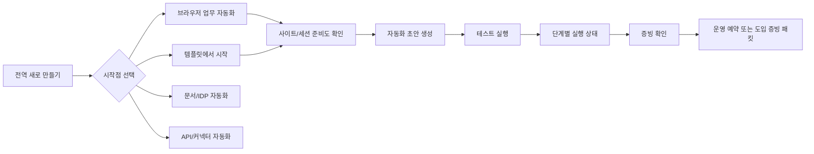

# RPA Console Workato-Inspired Guided Journey Design

Date: 2026-07-09
Status: design for implementation planning
Scope: PC web console UX, global creation actions, first automation journey, template preview, test-run status, evidence continuation
Out of scope: API/DB contract changes for P0, production readiness pass criteria changes, a new top-level route, full visual clone of Workato/Worlato

## 1. Purpose

The Workato/Worlato prototype showed a strong creation journey:

1. A single create entry point.
2. Clear start-point choices.
3. A focused builder.
4. A visible test run.
5. A direct next action after test success.

Our console already has many ingredients: adoption readiness, admin setup, evidence packet, security site/session corridor, natural-language scenario generation, run readiness, and run trace. The remaining UX gap is consistency. Users can complete the journey, but every screen does not yet make the next step equally obvious.

This design turns the current surfaces into one guided enterprise RPA journey:

> 사이트 등록 -> 로그인 세션 등록 -> 자동화 초안 생성 -> 테스트 실행 -> 실행 증빙 확인 -> 운영 예약/도입 증빙

The goal is not to copy Workato's information architecture. Our product must keep site/session governance, SecretRef, RBAC, readiness, and metadata-only evidence as first-class concepts.

## 2. References

- `audit/workato-uiux-2026-07-09/workato-uiux-audit.md`
- `audit/workato-uiux-2026-07-09/screenshots/`
- `docs/rpa-console-adoption-onboarding-design-2026-07-01.md`
- `docs/rpa-integrated-multi-perspective-design-2026-07-07.md`
- `web/src/components/Layout.tsx`
- `web/src/components/CommandPalette.tsx`
- `web/src/views/Scenarios.tsx`
- `web/src/components/PromptScenarioGenerator.tsx`
- `web/src/components/prompt-generator/GenerationResult.tsx`
- `web/src/components/RunScenarioButton.tsx`
- `web/src/views/Playground.tsx`
- `web/src/views/RunTrace.tsx`
- `web/src/views/ConnectorCatalog.tsx`
- `web/src/views/Security.tsx`
- `web/src/components/AdoptionEvidencePacket.tsx`

## 3. Design Brief

Product:

- Enterprise RPA control-plane console for operators, admins, CoE owners, and security reviewers.

Visual source:

- Current RPA console design system is authoritative.
- Workato/Worlato is a UX pattern reference only, not a visual clone.

Interactivity:

- Full production interactivity for P0/P1 slices.
- No static-only mock path for accepted implementation slices.

Primary change:

- Add a unified creation/action grammar and make the first automation journey continuous across dashboard, scenario studio, test run, security setup, connector templates, and evidence.

## 4. Design Principles

1. Journey first, contract always: the next action should be obvious, but contracts and readiness gates remain the source of truth.
2. No silent green: unknown, missing, deferred, warning, and blocked states must never render as success.
3. Evidence attached: successful creation or test should naturally lead to run trace and evidence, not just a saved object.
4. Role-aware by default: UI actions are filtered by permission, while backend RBAC remains authoritative.
5. No new top-level route in P0: use existing `dashboard`, `scenarioStudio`, `security`, `connectorCatalog`, `playground`, `runTrace`, and `automationOps`.
6. PC console first: optimize for 1280px+ desktop workflows; mobile remains regression coverage, not the acceptance target.
7. Use current visual language: keep the existing restrained console style, 8px radius, lucide icons, compact panels, and dense operational layout.
8. Do not expose secrets: SecretRef labels and metadata may appear; resolved values, tokens, endpoint URLs with credentials, raw prompt payloads, and raw audit bodies must not.

## 5. Target Journey



The shortest successful path should be:

1. `새로 만들기` -> `브라우저 업무 자동화`
2. 등록된 사이트가 없으면 `사이트 등록`
3. 로그인이 필요하면 `세션 등록`
4. 자연어로 업무 설명 입력
5. `자동화 초안 만들기`
6. `테스트 실행`
7. `증빙 확인`
8. `운영 예약` or `도입 증빙 패킷`

## 6. Proposed Product Surfaces

### 6.1 Global Create Menu

Add a `새로 만들기` button to the desktop topbar near global search. It is the user's command center for creation and setup.

Recommended component:

- New `web/src/components/GlobalCreateMenu.tsx`
- Mounted from `web/src/components/Layout.tsx`
- Mirrored as quick actions in `web/src/components/CommandPalette.tsx`

Menu items:

| Item | Primary route | Required permission | Readiness hint | Notes |
| --- | --- | --- | --- | --- |
| 자동화 초안 만들기 | `#scenarioStudio?creator=ai` | `scenario.create` | 사이트/세션 필요 시 화면에서 보정 | Default highlighted item |
| 사이트 등록 | `#security?section=sites&intent=site-create` | `site.create` | 파일럿 대상 사이트 준비 | Existing `SiteCreateForm` remains source of truth |
| 로그인 세션 등록 | `#security?section=sites&intent=session-capture` | `session.capture` or current site permission | 로그인 필요 사이트 준비 | If site is unknown, land on sites section |
| 템플릿에서 시작 | `#connectorCatalog?focus=templates` | `scenario.create` | SecretRef/입력값 확인 필요 | Opens catalog templates, not a new route |
| 테스트 실행 | `#playground` | `run.create` | 자동화 선택 후 실행 | Existing `PlaygroundView` remains |
| 증빙 확인 | `#runTrace?focus=artifacts` | `artifact.read` or run read role | 실행 후 증빙 확인 | If no run exists, show empty state |
| 운영 예약 | `#automationOps?section=schedule` | schedule/manage permission | 운영 전환 전 readiness 확인 | No readiness bypass |

Rules:

- Hide unauthorized write actions; do not show disabled admin-only buttons to standard operators unless the item is read-only.
- If a route is visible but action permission is missing, show a read-only menu item only when it helps explain what to request.
- Use lucide icons, not emoji or handcrafted SVG.
- The button label should stay `새로 만들기`; do not introduce Workato terms such as recipe.
- On mobile, this can be included in the account/search action group after desktop behavior is stable.

### 6.2 Start Point Chooser

Add a start-point chooser at the top of `scenarioStudio` when the user enters without a specific `creator`, `template_id`, or prefilled prompt.

Recommended component:

- New `web/src/components/automation-start/AutomationStartChooser.tsx`
- Used by `web/src/views/Scenarios.tsx`

Start cards:

| Card | State | Action |
| --- | --- | --- |
| 브라우저 업무 자동화 | P0 enabled | Opens existing natural-language generator with browser/site setup hints |
| 템플릿에서 시작 | P0 enabled | Navigates to `connectorCatalog?focus=templates` |
| 문서/IDP 자동화 | P1 enabled | Navigates to `documentIdp?mode=start` |
| API/커넥터 자동화 | P1 enabled | Navigates to connector catalog filtered to integration/API candidates |
| 처음부터 직접 설계 | P1 enabled but secondary | Opens current manual create details |
| AI Agent/MCP 자동화 | P2 candidate | `TODO: [BLOCKED]` product/API contract decision required before enabling |

Each card should show:

- What it creates.
- Required preparation: site, session, SecretRef, document sample, or connector profile.
- The next screen.
- One primary action.

Behavior:

- If `creator=ai`, scroll/focus the existing prompt input.
- If `template_id` is present, prefill from connector catalog and show a small "템플릿에서 시작" context strip above the prompt.
- If site/session is missing, do not block the chooser. Block only the unsafe run/generation action and show setup CTA.

### 6.3 Setup Corridor

The readiness corridor should appear consistently wherever creation or run starts:

- `scenarioStudio`
- `playground`
- generation result
- run launch panel
- dashboard readiness panel

Recommended component:

- New or shared `web/src/components/AutomationSetupCorridor.tsx`
- Use existing data from `listSites`, selected site, `session_ready`, gateway policies, and current permission checks.

Steps:

| Step | Ready condition | CTA |
| --- | --- | --- |
| 사이트 | at least one usable/approved site or selected target site | `사이트 등록` |
| 로그인 세션 | selected login-capable site has `session_ready=true` | `세션 등록` |
| 보안 연결 | required SecretRef/connector profile metadata exists | `보안 연결 확인` |
| 자동화 초안 | generation/scenario draft exists | `자동화 초안 만들기` |
| 테스트 실행 | run exists in test mode | `테스트 실행` |
| 증빙 | run artifacts or generation artifacts exist | `증빙 확인` |

Rules:

- Use `확인 필요`, `준비됨`, `보류`, `차단` labels.
- Do not infer SecretRef readiness unless an existing API field proves it.
- If readiness cannot be checked, show `확인 필요`, not green.
- Deep links should prefer specific sections: `#security?section=sites`, `#security?section=secrets`, `#runTrace?focus=artifacts`.

### 6.4 Focused Automation Studio

Workato's full-screen builder is useful, but our current P0 should not introduce an unproven canvas. Use a staged design.

P0:

- Keep `ScenariosView` as the main route.
- Make the top area read as a coherent studio:
  - start chooser or natural-language creation
  - setup corridor
  - existing generator
  - browser recorder as secondary path
  - manual form collapsed as exception path

P1:

- Add a focused mode inside the same route:
  - `#scenarioStudio?mode=focus&scenario=<id>`
  - topbar inside view: name, draft/prod badge, save, test, exit
  - local tabs: `설계`, `테스트`, `연결`, `버전`, `설정`
  - left/center: generated step list or future graph canvas
  - right rail: AI edit prompt, setup corridor, evidence/readiness

P1 does not require a new route key. It can be a mode of `ScenariosView`.

Do not:

- Hide security/readiness behind a pure builder canvas.
- Expose raw IR JSON as the primary builder experience.
- Claim visual canvas parity with Workato until graph editing behavior is implemented.

### 6.5 Template Detail Preview

The current connector catalog has a useful template table and draft CTA. Add a template detail panel before generation to reduce uncertainty.

Recommended component:

- New `web/src/views/connectors/TemplateDetailPanel.tsx`
- Open from template row click or `템플릿 보기`

Panel contents:

- Template name and connector.
- Status and priority.
- Expected automation pattern from `produced_ir_pattern`.
- Required input params.
- Required SecretRefs as labels only.
- Required RBAC actions.
- Success criteria.
- Site/session readiness hint if the connector has a browser start URL.
- CTA: `이 템플릿으로 자동화 초안 만들기`.

Step preview:

- P0: show a human-readable expected pattern from existing template metadata.
- P1: show exact generated steps only if the API exposes template IR or step metadata.
- `TODO: [BLOCKED]` Exact template step preview requires a contract decision if current catalog data does not include ordered steps.

### 6.6 Test Run Status Panel

Workato's test-running and test-success screens are directly applicable. Our `RunScenarioButton` already navigates to `runTrace` after creating a run. The missing piece is a first-class progress panel.

Recommended component:

- New `web/src/views/runtrace/TestRunStatusPanel.tsx`
- Render inside `RunDetailPanel` above `StepTrace`
- Use existing `GET /v1/runs/{id}` and `GET /v1/runs/{id}/steps`

States:

| Run/step state | Label | Next action |
| --- | --- | --- |
| queued | 테스트 대기 중 | 우선순위 확인 or 취소 |
| running | 테스트 실행 중 | 단계 진행 보기 |
| suspended | 사람 확인 대기 | 사람 확인 처리 |
| failed_system | 시스템 실패 | 세션 등록, SecretRef, 재실행, 상세 원인 |
| failed_business | 업무 실패 | 입력값 수정, 사람 확인, 재실행 |
| completed | 테스트 성공 | 증빙 확인, 운영 예약, 봇으로 굳히기 |
| skipped step | 스킵 | 스킵 사유 확인 |

Visual behavior:

- Show a compact banner: `테스트 실행 중`, `테스트 성공`, `테스트 실패`.
- Show step rows with status chips and timestamps.
- Keep `StepTrace` as detailed evidence; the status panel is the operator summary.
- On success, primary CTA should be `증빙 확인`; secondary CTA should be `운영 예약`.
- On failure, primary CTA should be the best recovery action, not raw error details.

### 6.7 Evidence Continuation

Generation and run result screens should always show where evidence lives.

Existing strengths:

- `GenerationResult` already shows generation artifacts and execution result evidence.
- `RunDetailPanel` already includes generation artifacts, step trace, run artifacts, and promote-from-run.
- `AdoptionEvidencePacket` already packages metadata-only evidence.

Design changes:

- After generation success without run: show next `테스트 실행`.
- After generation with run queued/running: show `실행 상태 보기`.
- After completed run: show `증빙 확인` first, then `운영 예약`.
- Dashboard evidence packet should link back into the same journey, not read as a separate report.

### 6.8 Activity Timeline Summary

Workato's activity timeline is easy to scan. Keep our audit table for detailed review, but add a lightweight timeline summary where it helps context.

P1/P2 placements:

- Dashboard: recent adoption events.
- Scenario detail/focused mode: recent changes, tests, promotions, evidence events.
- Security sites section: site registration, approval, session capture, session renewal.

Rules:

- Timeline is summary only.
- Detailed audit explorer remains canonical.
- Each event should show actor, object, result, and evidence/audit link when available.
- Missing audit data should read as `감사 이벤트 확인 필요`, not empty success.

### 6.9 Workspace And Environment Context

Workato's workspace/environment badge is useful, but our current `Layout` intentionally avoids displaying tenant because the frontend does not verify tenant identity.

P0:

- Do not add a tenant badge unless the API exposes a trusted display name and environment.
- Keep current subject and role chips.

P1:

- Add environment context only from a trusted API, for example:
  - `environment`: local, dev, staging, controlled-prod, prod
  - `tenant_display_name`
  - `workspace_display_name`
  - `controlled_prod_ready`

`TODO: [BLOCKED]` Environment/workspace display requires a trusted read contract. Do not infer from token or browser storage.

## 7. Data And API Mapping

P0 uses existing data where possible.

| UX need | Existing source |
| --- | --- |
| Permission filtering | `useCan`, `useRoles`, backend RBAC |
| Site/session readiness | `listSites`, `SiteItem.login_capable`, `SiteItem.session_ready` |
| Natural-language generation | scenario generation APIs already used by `PromptScenarioGenerator` |
| Gateway policy/model readiness | `listGatewayPolicies`, `getGatewayPolicy` |
| Template metadata | connector catalog and template catalog APIs |
| Test run | `createRun`, `listRuns`, `getRun`, `listRunSteps` |
| Evidence | generation artifacts, run artifacts, `AdoptionEvidencePacket` inputs |
| Production readiness | `GET /v1/ops/production-readiness` |

Potential P1/P2 additive contracts:

- Trusted console environment context.
- Ordered template step preview.
- Activity timeline summary endpoint if audit search cannot efficiently support summary cards.

Any additive contract must update `api-surface.md`, OpenAPI/codegen, app tests, and web tests.

## 8. Role And Security Rules

| Role/context | Expected behavior |
| --- | --- |
| viewer | May see read-only journey status and evidence summaries; no setup/write CTAs |
| operator | Sees create automation, test run, evidence, and permitted site/session actions |
| admin | Sees all setup, security, SecretRef, SCIM, readiness, and evidence actions |
| security reviewer | Sees evidence/readiness/security status and audit links, not unsafe write defaults |
| internal flag off | Internal-only routes/actions remain hidden from nav, palette, and create menu |

Security invariants:

- The global menu is a navigation aid, not an authorization layer.
- Do not render resolved SecretRef material.
- Do not render raw endpoint URLs, webhook URLs, credentials, tokens, raw prompt payloads, or raw audit payload bodies.
- Session capture is framed as operator PC registration, not credential collection.
- Unknown readiness is `확인 필요`.

## 9. Copy System

Preferred Korean labels:

| Intent | Label |
| --- | --- |
| Global action | 새로 만들기 |
| Start automation | 자동화 초안 만들기 |
| Site setup | 사이트 등록 |
| Login setup | 세션 등록 |
| Start from template | 템플릿에서 시작 |
| Run test | 테스트 실행 |
| View run | 실행 상태 보기 |
| View evidence | 증빙 확인 |
| Schedule ops | 운영 예약 |
| Readiness missing | 확인 필요 |
| Deferred evidence | 증빙 보류 |
| Blocked | 차단 |

Avoid:

- 레시피, 프로젝트, 앱 만들기 as primary IA terms.
- Raw enum strings.
- English labels on operator-facing controls unless they are product names.
- "준비됨" when evidence is merely absent or not checked.

## 10. Visual And Interaction Requirements

- Use current CSS tokens in `web/src/styles.css`.
- Cards and menus should keep 8px radius or less.
- Use icons from `lucide-react`.
- Do not nest cards inside cards.
- Keep dense but readable PC layouts.
- Use popovers/menus for global create actions.
- Use segmented controls or tabs for local modes.
- Use tooltips/title only as supplemental; visible labels must still be understandable.
- Ensure keyboard access:
  - global create button opens with Enter/Space
  - Esc closes menu/panel
  - focus returns to trigger
  - menu items are reachable by Tab or roving active item

## 11. Implementation Slices

### Slice W0: Design Traceability

Goal:

- Land this design and link it to the Workato UI/UX audit.

Files:

- `docs/rpa-console-workato-inspired-guided-journey-design-2026-07-09.md`
- `audit/workato-uiux-2026-07-09/workato-uiux-audit.md`

Validation:

- `git diff --check`

### Slice W1: Global Create Menu

Goal:

- Make creation/setup actions discoverable from every screen.

Likely files:

- `web/src/components/GlobalCreateMenu.tsx`
- `web/src/components/Layout.tsx`
- `web/src/components/CommandPalette.tsx`
- `web/src/styles.css`
- `web/test/command-palette.test.tsx`
- New `web/test/global-create-menu.test.tsx`

Acceptance criteria:

- Desktop topbar shows `새로 만들기` for roles with at least one permitted create/setup action.
- Menu contains automation, site, session, template, test, evidence, and ops actions when permitted.
- Hidden/internal actions do not leak through the menu.
- Selecting each item navigates with the correct route params.
- Keyboard open/close/focus behavior works.

### Slice W2: Start Point Chooser

Goal:

- Make `scenarioStudio` start from clear automation types instead of a single undifferentiated form.

Likely files:

- `web/src/components/automation-start/AutomationStartChooser.tsx`
- `web/src/views/Scenarios.tsx`
- `web/src/components/PromptScenarioGenerator.tsx`
- `web/src/styles.css`
- `web/test/scenario-studio-first-action.test.tsx`

Acceptance criteria:

- First desktop viewport shows the start chooser when no prefilled creator/template prompt exists.
- Browser automation starts the current natural-language generator.
- Template start navigates to connector catalog templates.
- Manual form remains secondary/collapsed.
- AI Agent/MCP appears only as disabled/candidate or is omitted until product/API contract exists.

### Slice W3: Setup Corridor

Goal:

- Make site/session/SecretRef/test/evidence readiness visible in creation and run contexts.

Likely files:

- `web/src/components/AutomationSetupCorridor.tsx`
- `web/src/views/Scenarios.tsx`
- `web/src/components/PromptScenarioGenerator.tsx`
- `web/src/components/run-scenario/ReadinessCard.tsx`
- `web/test/session-registration-cta.test.tsx`
- `web/test/scenario-studio-first-action.test.tsx`

Acceptance criteria:

- Missing site links to `#security?section=sites`.
- Missing session links to `#security?section=sites&site=<id>` when known.
- Unknown readiness is not green.
- Viewer/read-only roles do not see write CTAs.

### Slice W4: Template Detail Preview

Goal:

- Let users understand what a template will create before prefilled generation.

Likely files:

- `web/src/views/connectors/TemplateDetailPanel.tsx`
- `web/src/views/ConnectorCatalog.tsx`
- `web/src/views/connectors/catalog-labels.tsx`
- `web/test/connector-catalog.test.tsx`

Acceptance criteria:

- Template detail panel shows pattern, params, SecretRefs, success criteria, and draft CTA.
- CTA preserves current prefill behavior into `scenarioStudio`.
- Exact ordered steps are not fabricated when the API lacks that data.

### Slice W5: Test Run Status Panel

Goal:

- Make test run progress and results readable before detailed trace analysis.

Likely files:

- `web/src/views/runtrace/TestRunStatusPanel.tsx`
- `web/src/views/runtrace/RunDetailPanel.tsx`
- `web/src/components/StepTrace.tsx` or existing step trace component only if shared helpers are needed
- `web/test/run-trace.test.tsx`
- `web/test/playground.test.tsx`

Acceptance criteria:

- Newly created test runs land on a clear status panel.
- Completed runs show `테스트 성공` plus `증빙 확인`.
- Failed runs show recovery CTA before raw technical detail.
- StepTrace remains accessible as detailed evidence.

### Slice W6: Evidence Continuation

Goal:

- Close the loop from creation/test to evidence packet and operations.

Likely files:

- `web/src/components/prompt-generator/GenerationResult.tsx`
- `web/src/views/runtrace/RunDetailPanel.tsx`
- `web/src/components/AdoptionEvidencePacket.tsx`
- `web/test/dashboard.test.tsx`
- `web/test/run-trace.test.tsx`

Acceptance criteria:

- Generation result without run points to test execution.
- Generation result with run points to run status/evidence.
- Completed run points to evidence first, operations second.
- Evidence packet links back to run trace and readiness, not duplicated raw payloads.

### Slice W7: Focused Studio And Timeline

Goal:

- Add Workato-like focus mode and activity summary once P0 journey is stable.

Likely files:

- `web/src/views/Scenarios.tsx`
- new scenario detail/focus components
- `web/src/views/AuditExplorer.tsx` helpers or new activity summary component
- tests to be defined with the concrete implementation

Acceptance criteria:

- Focus mode keeps setup/readiness/evidence visible.
- Activity timeline is summary-only and links to canonical audit details.
- No new top-level route unless product owner explicitly approves.

## 12. Testing And Validation

P0/P1 web commands:

```powershell
npm --prefix web run typecheck
npm --prefix web test
npm --prefix web run build
git diff --check
```

Focused tests:

- `web/test/global-create-menu.test.tsx`
- `web/test/command-palette.test.tsx`
- `web/test/scenario-studio-first-action.test.tsx`
- `web/test/session-registration-cta.test.tsx`
- `web/test/connector-catalog.test.tsx`
- `web/test/playground.test.tsx`
- `web/test/run-trace.test.tsx`
- `web/test/dashboard.test.tsx`
- `web/test/a11y.test.tsx`

Manual/visual QA:

- Desktop 1280x720 and 1440x900.
- Verify no topbar overlap after adding `새로 만들기`.
- Verify menu is keyboard usable.
- Verify first viewport of dashboard, scenario studio, connector catalog, playground, and run trace each exposes a clear next action.
- Verify secret/session/audit raw values are not rendered.

## 13. Success Metrics

Product signals:

- A first-time operator can identify the next setup action from the dashboard or scenario studio within the first viewport.
- A business user can start an automation from text, template, or browser recording without discovering three separate screens.
- A completed test run has a visible evidence path.
- A missing site/session is shown as a setup action, not as a generic error.

Expected score impact:

| Score lane | Before this design | After W1-W6 |
| --- | ---: | ---: |
| User first-action clarity | 84-86 | 90-92 |
| First automation confidence | 86-88 | 91-93 |
| Admin setup discoverability | 88-90 | 91-93 |
| Security/evidence confidence | 89-91 | 91-94 |
| UI/UX review score | 88-90 | 91-93 |

This score movement assumes implementation and verification, not design text alone.

## 14. Risks

| Risk | Mitigation |
| --- | --- |
| Global menu becomes a junk drawer | Limit to creation/setup/evidence actions; keep navigation in search/palette |
| Workato-like cards reduce density | Keep compact PC console layout and 8px radius |
| Start chooser hides existing fast path | Deep links and `creator=ai` must focus the existing generator immediately |
| Template preview fabricates steps | Use existing metadata in P0; block exact steps until contract exists |
| Environment badge overclaims tenant context | Do not display tenant/workspace until trusted API exists |
| Security reviewers lose evidence trail | Keep evidence links and readiness in every creation/test continuation |

## 15. Open Decisions

| Decision | Owner | Default |
| --- | --- | --- |
| AI Agent/MCP start card contract | Product/Architecture | Disabled or omitted until contract exists |
| Trusted workspace/environment read API | Architecture/Security | Do not display inferred tenant/workspace |
| Exact ordered template step preview | Product/API owner | Metadata-only preview in P0 |
| Focused studio graph editing | Product/UI owner | Step list first; graph canvas later |
| Dedicated adoption/evidence route | Product owner | No new route in P0 |

## 16. Final Design Position

The Workato prototype's most valuable lesson is not the blue shell or large cards. It is the clear handoff between create, build, test, and evidence.

Our console should adopt that journey grammar while preserving our enterprise guarantees:

> Make the next action obvious, but never make readiness look better than the evidence proves.
